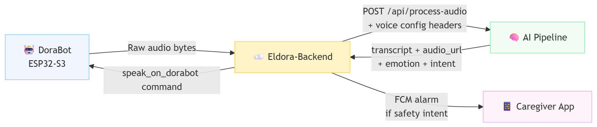
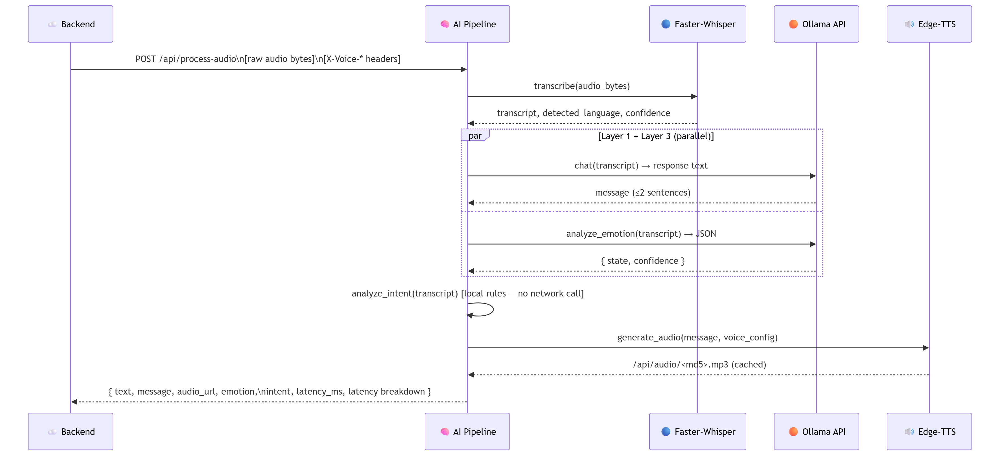

<div align="center">

# 🧠 Eldora-AI-Pipeline — ELDORA Voice AI Service

### *Protect. Respond. Recover.*

[](https://www.python.org/)
[](https://fastapi.tiangolo.com/)
[](https://github.com/SYSTRAN/faster-whisper)
[](https://ollama.com/)
[](https://github.com/rany2/edge-tts)
[](LICENSE)
[](https://github.com/)

<br/>

**The voice AI service for the ELDORA ecosystem — a four-layer pipeline that takes raw audio from DoraBot, transcribes it with Faster-Whisper, generates an empathic response via Ollama, classifies safety intents with local rules, analyzes emotion via Ollama, synthesizes speech with Edge-TTS, and returns a cached audio URL with full latency telemetry.**

[🌐 ELDORA Ecosystem](https://github.com/Eldoraaa) · [☁️ Backend](https://github.com/Eldoraaa/eldora-backend) · [🤖 DoraBot](https://github.com/Eldoraaa/dorabot) · [📱 Mobile App](https://github.com/Eldoraaa/eldora-mobile)

</div>

---

## 📌 Overview

Eldora-AI-Pipeline is the **voice intelligence engine** of the ELDORA eldercare ecosystem. It runs as a standalone FastAPI microservice, called exclusively by the ELDORA backend whenever DoraBot uploads a voice recording from an elderly user. The pipeline converts raw audio into a meaningful spoken response and a structured safety signal — all within a strict latency budget.

> **Eldora-AI-Pipeline's role in the ELDORA ecosystem:**
> *"The voice — listening to what the elder says, understanding what they need, and speaking back with warmth and clarity."*

| | |
|---|---|
| **Runtime** | Python 3.11 |
| **Framework** | FastAPI + Uvicorn |
| **STT** | Faster-Whisper (CTranslate2-optimized Whisper) — local, CPU or CUDA |
| **LLM** | Ollama API — Qwen2.5:1.5b (configurable, optional API key) |
| **Intent** | Local rule-based classifier — bilingual (English + Bahasa Indonesia) |
| **Emotion** | Ollama API — runs in parallel with LLM response generation |
| **TTS** | Microsoft Edge-TTS — MD5-keyed audio file cache |
| **Deployment** | Docker / Railway |

---

## 🌐 ELDORA Ecosystem

Eldora-AI-Pipeline is the **voice intelligence** layer called by the backend:

```
ELDORA Ecosystem
├── 🛡️  DoraShield         — Fall detection wearable (ESP32)
├── 🤖  DoraBot             — AI voice companion (ESP32-S3) — uploads raw audio
├── ☁️   Eldora-Backend      — API server — calls this pipeline, routes results
├── 🧠  Eldora-AI-Pipeline  — Voice AI service (this repo) — STT + LLM + TTS
└── 📱  Eldora-Mobile       — Caregiver app — receives FCM alerts triggered by this pipeline
```



---

## ✨ Pipeline Features

- 🎙️ **Local Speech-to-Text** — Faster-Whisper transcribes audio on-device; auto-detects CUDA and falls back gracefully to CPU int8 mode
- 💬 **LLM Conversational Response** — Ollama API generates a warm, concise (≤ 2 sentences) response tailored for elderly users
- 🔍 **Bilingual Intent Classification** — local rule-based engine detects safety intents in both English and Bahasa Indonesia with no external call
- 😊 **Emotion Analysis** — Ollama API classifies the elder's emotional state; runs in parallel with response generation to minimize latency
- 🔊 **Edge-TTS Speech Synthesis** — Microsoft Edge-TTS produces natural MP3 audio with MD5-keyed caching to avoid re-synthesis of identical responses
- 📡 **Per-Request Voice Configuration** — caller sets language, TTS voice, speech rate, and enabled/disabled via HTTP headers on each request
- 📊 **Structured Latency Telemetry** — every response includes a per-stage latency breakdown (audio receive, STT, AI+emotion, TTS, total)
- 🔄 **Graceful Degradation** — if Ollama is unavailable, the service continues with local fallback responses and still performs STT + TTS
- 🐳 **Docker-First Deployment** — single `Dockerfile` handles all system dependencies including `ffmpeg`; GPU acceleration supported via NVIDIA Container Toolkit

---

## 🛠️ Tech Stack

| Layer | Technology | Purpose |
|---|---|---|
| **Framework** | FastAPI + Uvicorn | Async HTTP API server |
| **Language** | Python 3.11 | Pipeline implementation |
| **STT** | faster-whisper ≥1.0 | CTranslate2-optimized Whisper for local transcription |
| **LLM / Emotion** | httpx → Ollama API | Async calls to Qwen2.5 for response generation and emotion analysis |
| **TTS** | edge-tts ≥6.1 | Microsoft Edge neural TTS voices, MP3 output |
| **Validation** | Pydantic v2 | Request/response models |
| **HTTP Client** | httpx | Async Ollama API calls |
| **Audio** | ffmpeg (system) | Audio decoding for Faster-Whisper input |
| **Containerization** | Docker + Docker Compose | Reproducible deployment with optional GPU passthrough |
| **Deployment** | Railway (`railway.json`) | Cloud deployment via Dockerfile builder |

---

## 📁 Project Structure

```
Eldora-AI-Pipeline/
│
├── 📄 main.py                  # Complete FastAPI service — all four pipeline layers,
│                               # API endpoints, VoiceProcessor class, audio cache server
│
├── 📄 test_suite.py            # Evaluation client — Levenshtein STT accuracy,
│                               # 2-sentence constraint check, latency SLA tests
├── 📄 test_cases.json          # 10 representative elderly voice scenario test cases
│
├── 📄 convert_hf_to_gguf.py   # Utility — converts HuggingFace PyTorch weights
│                               # to GGUF format for Ollama import (for custom LoRA models)
│
├── 📄 requirements.txt         # Python dependencies (fastapi, uvicorn, faster-whisper,
│                               # edge-tts, httpx, pydantic, python-multipart)
│
├── 📄 Dockerfile               # python:3.11-slim + ffmpeg + git; exposes port 8000
├── 📄 docker-compose.yml       # Compose with audio_cache + HF model cache volumes,
│                               # optional NVIDIA GPU reservation
├── 📄 railway.json             # Railway deployment config — Dockerfile builder,
│                               # /health check, ON_FAILURE restart policy
│
├── 📄 .env.example             # All configurable environment variables with defaults
└── 📁 test_audio/              # Holds .wav files for test_suite.py (git-ignored)
```

---

## ⚙️ How the Pipeline Works



**In plain English:**
```
DoraBot uploads audio → backend forwards raw bytes to POST /api/process-audio

Layer 0 — STT:     Faster-Whisper transcribes audio → transcript + language + confidence
Layer 1 — LLM:     Ollama generates warm 1–2 sentence response  ┐ run in parallel
Layer 2 — Intent:  Local rules classify safety intent           ├ (Layer 2 is sync, no I/O)
Layer 3 — Emotion: Ollama classifies emotion state              ┘
TTS     — Synthesis: Edge-TTS synthesizes MP3 → stored in audio_cache/

Return: { transcript, response_message, audio_url, emotion, intent, latency }
```

---

## 🔍 Pipeline Layers in Detail

### Layer 0 — Speech-to-Text (Local Faster-Whisper)

Faster-Whisper is a CTranslate2-optimized reimplementation of OpenAI Whisper. It runs entirely locally — no audio ever leaves the server.

| Setting | Behavior |
|---|---|
| `STT_DEVICE=cuda` | Runs with `float16` compute — fastest, requires NVIDIA GPU |
| `STT_DEVICE=cpu` | Runs with `int8`, 4 threads — slower but runs everywhere |
| `STT_DEVICE=auto` | Tries CUDA first, falls back to CPU automatically |
| `STT_MODEL_SIZE` | `tiny` / `base` / `small` / `medium` / `large` — trades speed for accuracy |

Language detection runs automatically. If detected language is not English or Indonesian, it defaults to English. Transcriptions with confidence < 0.7 are flagged in logs.

### Layer 1 — Conversational Response (Ollama API)

The pipeline calls the configured Ollama endpoint with a system prompt that constrains responses to **exactly 1–2 sentences** to prevent cognitive overload for elderly users. Default model: `qwen2.5:1.5b` (1.5 billion parameters, fast on modest hardware).

```
System: "You are Eldora, a warm voice companion for elderly users.
         Respond in EXACTLY 1 or 2 short sentences."
Temperature: 0.4 | num_predict: 50 | timeout: 15s
```

If Ollama is unreachable, the service falls back to **local keyword-matched responses** covering all safety and care scenarios — the pipeline never silently fails.

### Layer 2 — Intent Classification (Local Rules)

Runs synchronously with no external call. Detects six safety/care intents in both **English and Bahasa Indonesia**:

| Intent | Example Triggers | Notifies Caregiver |
|---|---|---|
| `call_family` | "call my family", "panggil keluarga" | ✅ + call flag |
| `fall_detected` | "i fell", "fallen", "jatuh" | ✅ |
| `help_request` | "help", "emergency", "tolong", "sakit" | ✅ |
| `water_request` | "water", "drink", "minum", "haus" | ✅ |
| `medicine_request` | "medicine", "pill", "obat" | ✅ |
| `emotional_support` | "lonely", "scared", "kesepian" | ❌ (comfort response only) |
| `general` | (catch-all) | ❌ |

### Layer 3 — Emotion Analysis (Ollama API, Parallel)

Runs **concurrently** with Layer 1 using `asyncio.gather` so it adds no serial latency. The same Ollama model classifies the transcript into five states: `calm`, `happy`, `sad`, `anxious`, `distressed`. Temperature: 0.1 for deterministic classification.

The emotion result is returned to the backend, which stores it in `TrVoiceEmotionLog` to power the caregiver's analytics dashboard.

### TTS — Speech Synthesis (Edge-TTS + Cache)

Edge-TTS generates MP3 audio using Microsoft's neural TTS voices. Generated files are stored in `audio_cache/` with an **MD5-keyed filename** (`voice + rate + text`) — identical responses are served from cache without re-synthesis.

Default voices:
- English: `en-US-JennyNeural`
- Indonesian: `id-ID-GadisNeural`

TTS voice, rate, and language can be overridden per-request via `X-Voice-TTS-Voice`, `X-Voice-Rate`, and `X-Voice-Language` headers — the backend sets these from the per-device voice configuration stored in `MsDeviceVoiceConfig`.

---

## 🔑 API Reference

| Endpoint | Method | Auth | Description |
|---|---|---|---|
| `/health` | GET | None | Service health — STT model status, Ollama connectivity, active device |
| `/api/process-audio` | POST | None | Full pipeline — raw audio bytes in, full response out |
| `/api/test-tts` | POST | None | TTS preview — synthesize text to MP3 without STT or LLM |
| `/api/audio/{filename}` | GET | None | Serve a cached MP3 audio file from `audio_cache/` |

### `POST /api/process-audio`

**Request:** raw audio bytes in the body (any format ffmpeg can decode, minimum 1000 bytes)

**Voice config headers** (all optional — fall back to server defaults):

| Header | Example | Description |
|---|---|---|
| `X-Voice-Language` | `en` | Target language for STT hint and TTS voice pack selection |
| `X-Voice-TTS-Voice` | `en-US-AriaNeural` | Override TTS voice for this request |
| `X-Voice-Rate` | `-5%` | Speech rate adjustment |
| `X-Voice-Enabled` | `true` | Set `false` to skip TTS synthesis entirely |

**Response:**
```json
{
  "text": "Eldora, I need some water.",
  "message": "Got it, I will let your caregiver know that you need some water.",
  "audio_url": "/api/audio/tts_a3f2c1d9e4b8.mp3",
  "language": "en",
  "confidence": 0.94,
  "response_source": "ollama_qwen",
  "emotion": { "state": "anxious", "confidence": 0.82 },
  "intent": { "name": "water_request", "confidence": 0.78, "notify_caregiver": true, "call_family": false },
  "latency_ms": 1243.5,
  "latency": {
    "audio_ms": 4.1,
    "stt_ms": 680.2,
    "ai_ms": 490.3,
    "tts_ms": 68.9,
    "total_ms": 1243.5
  }
}
```

---

## ⚙️ Configuration

Create a `.env` file in the project root (copy from `.env.example`):

```env
PORT=8000
LOG_LEVEL=INFO

# Faster-Whisper STT
STT_MODEL_SIZE=base          # tiny | base | small | medium | large
STT_DEVICE=auto              # auto | cuda | cpu

# Ollama LLM + Emotion
OLLAMA_API_URL=http://localhost:11434/api/chat
OLLAMA_API_KEY=              # leave empty if no auth required
OLLAMA_MODEL_NAME=qwen2.5:1.5b

# Default TTS settings (overridable per-request via headers)
VOICE_LANGUAGE=en
VOICE_TTS_VOICE=en-US-JennyNeural
VOICE_TTS_RATE=-10%
VOICE_AUDIO_CACHE_DIR=./audio_cache
```

> ℹ️ If `OLLAMA_API_URL` is empty or unreachable, the service operates in **fallback mode** — STT and TTS still work, and local keyword responses are used in place of LLM-generated replies.

---

## 🚀 Build & Run

### Prerequisites

- [Python 3.11+](https://www.python.org/downloads/)
- [ffmpeg](https://ffmpeg.org/) (system dependency for audio decoding)
- [Ollama](https://ollama.com/) running locally or a hosted Ollama-compatible endpoint
- (Optional) NVIDIA GPU + CUDA for accelerated STT

### Local Development

```bash
# 1. Clone the repository
git clone https://github.com/Eldoraaa/eldora-ai-pipeline.git
cd eldora-ai-pipeline

# 2. Create and activate a virtual environment
python -m venv .venv
source .venv/bin/activate      # Linux / macOS
.\.venv\Scripts\Activate.ps1   # Windows

# 3. Install dependencies
pip install -r requirements.txt

# 4. Copy and fill in environment variables
cp .env.example .env
# Set OLLAMA_API_URL to your Ollama endpoint

# 5. Pull the Ollama model (if running Ollama locally)
ollama pull qwen2.5:1.5b

# 6. Start the service
python main.py
```

The service starts at `http://localhost:8000`.
Swagger UI is available at `http://localhost:8000/docs`.

On first start, Faster-Whisper downloads the configured model from Hugging Face and caches it locally. Subsequent starts load from cache.

### Docker (Recommended)

Docker handles all system dependencies (`ffmpeg`, Python) automatically.

```bash
# Build and start
docker compose up --build

# Run in background
docker compose up -d --build
```

The compose file maps two volumes for persistence:
- `./audio_cache` — synthesized Edge-TTS MP3 files
- `./.hf_cache` — downloaded Faster-Whisper models (avoids re-download on container restart)

<details>
<summary><b>GPU acceleration in Docker</b></summary>

<br/>

The `docker-compose.yml` includes an NVIDIA GPU reservation block. To use it, install the [NVIDIA Container Toolkit](https://docs.nvidia.com/datacenter/cloud-native/container-toolkit/latest/install-guide.html) on the host. If no GPU or NVIDIA runtime is available, remove the `deploy:` block from `docker-compose.yml` and set `STT_DEVICE=cpu`.

</details>

### Railway Deployment

The `railway.json` configures Railway to build from the `Dockerfile` and run `python main.py` as the start command.

```env
# Required env vars on Railway
PORT=8000
STT_MODEL_SIZE=base
STT_DEVICE=cpu
OLLAMA_API_URL=https://your-hosted-ollama.example.com/api/chat
OLLAMA_API_KEY=your-bearer-token-if-required
OLLAMA_MODEL_NAME=qwen2.5:1.5b
VOICE_LANGUAGE=en
VOICE_TTS_VOICE=en-US-JennyNeural
VOICE_TTS_RATE=-10%
VOICE_AUDIO_CACHE_DIR=/app/audio_cache
```

After deploying, set these in the ELDORA backend `.env`:
```env
VOICE_AUDIO_PROCESSOR_URL=https://your-pipeline.up.railway.app/api/process-audio
VOICE_AUDIO_BASE_URL=https://your-pipeline.up.railway.app
```

---

## 🧪 Testing & Evaluation

The repository includes an automated evaluation suite (`test_suite.py`) that tests the running service against `test_cases.json` (10 representative elderly voice scenarios).

```bash
# 1. Place test audio files (1.wav to 10.wav) in test_audio/
# 2. Ensure the service is running at http://localhost:8000
# 3. Run the suite
python test_suite.py
```

### Metrics evaluated:

| Metric | Description |
|---|---|
| **STT Accuracy** | Character-level Levenshtein similarity between Faster-Whisper output and ground-truth transcripts |
| **Cognitive sentence constraint** | Verifies LLM responses contain ≤ 2 sentences (prevents overload for elderly users) |
| **Latency SLA** | Measures per-stage latency against a 1.5 s total latency target |

---

## 🔧 Custom Model (LoRA Fine-Tuning)

The repository includes `convert_hf_to_gguf.py` to convert a fine-tuned HuggingFace model to GGUF format for Ollama import.

```bash
# 1. Convert merged PyTorch weights to GGUF
python convert_hf_to_gguf.py --model-dir ./merged_eldercare_qwen2 --output-file ./eldora_bot.gguf

# 2. Create an Ollama Modelfile
cat > Modelfile << 'EOF'
FROM ./eldora_bot.gguf
SYSTEM "You are Eldora, a supportive voice companion for seniors. Speak warmly, keep answers under 2 sentences."
EOF

# 3. Register in Ollama
ollama create eldora-bot -f Modelfile

# 4. Update OLLAMA_MODEL_NAME in .env
OLLAMA_MODEL_NAME=eldora-bot
```

---

## 👥 Team

<div align="center">

**ELDORA — BINUS BM Team**
*Passage to ASEAN Hackathon 2026*

| Name | Role |
|---|---|
| **Stanley Nathanael Wijaya** | Team Lead |
| **Lutfi Alvaro Pratama** | IoT Engineer |
| **Andrian Pratama** | Mobile Developer |
| **Khalisa Amanda Sifa Ghaizani** | Backend Developer |
| **Devon Nicholas** | AI Engineer |

</div>

---

## 📧 Contact

Have questions, want to collaborate, or interested in ELDORA?

| Channel | Details |
|---|---|
| 📧 Email | [stanley.n.wijaya7@gmail.com](mailto:stanley.n.wijaya7@gmail.com) |
| ✈️ Telegram | [@xstynwx](https://t.me/xstynwx) |
| 💬 Discord | `stynw7` |

---

<div align="center">

[](https://github.com/)
[](https://binus.ac.id/)

<br/>
Made with 🤍 by BINUS BM Team 🔥

</div>
