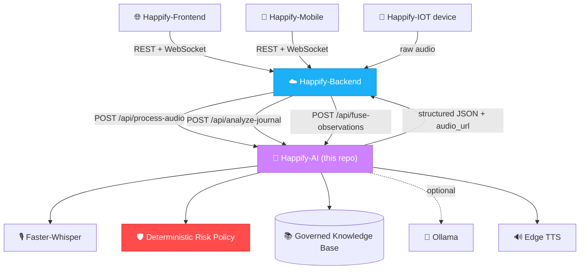
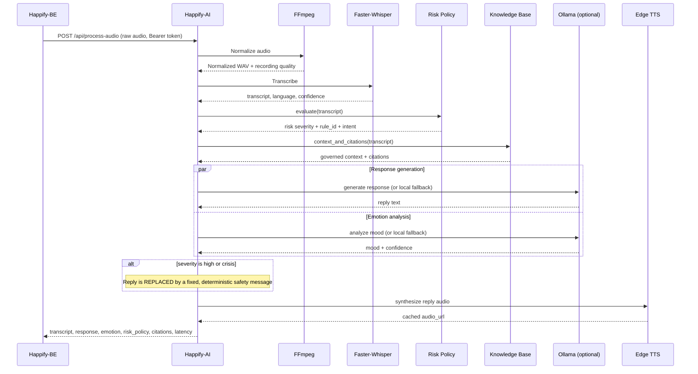
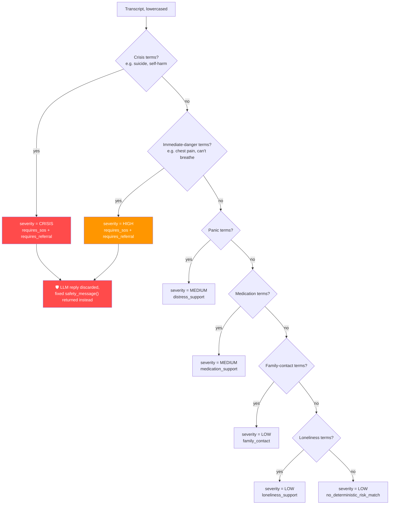

<div align="center">

# 🧠 Happify-AI — Voice & Journal Intelligence Service

### *Detect Early. Support Meaningfully. Grow for Life.*

[](https://www.python.org/)
[](https://fastapi.tiangolo.com/)
[](https://github.com/SYSTRAN/faster-whisper)
[](https://github.com/rany2/edge-tts)
[-000000?style=flat-square)](https://ollama.com/)
[](https://docs.pydantic.dev/)
[](https://railway.app/)
[](../LICENSE)
[](https://garudahacks.com/)

<br/>

**The AI reasoning core of Happify — a FastAPI service that transcribes voice, generates supportive companion responses, detects mood and risk, reflects on journal entries, and speaks back — all governed by a deterministic safety layer that no language model is allowed to weaken.**

[🌐 Frontend](https://github.com/Happiffy/Happify-FE) · [☁️ Backend](https://github.com/Happiffy/Happify-BE) · [🧠 AI](https://github.com/Happiffy/Happify-AI) · [📱 Mobile](https://github.com/Happiffy/Happify-Mobile) · [🔌 IoT](https://github.com/Happiffy/Happify-IOT)

</div>

---

## 📌 Overview

Happify-AI is the **reasoning layer** of the Happify ecosystem. It never talks to end users directly — it receives authenticated requests from **Happify-BE** and returns a structured, contract-shaped response: a transcript, a companion reply, a detected mood, a risk severity, and (optionally) synthesized speech.

> **Happify-AI's role in the ecosystem:**
> *"The mind, but not the judge — it listens, reflects, and suggests, while a deterministic policy layer, not the model, decides when a situation is serious enough to escalate to a human."*

Happify-AI is explicitly an **early-support system**. It is not a psychologist, psychiatrist, diagnostic tool, or emergency service — every response is generated (or overridden) with that boundary in mind.

| | |
|---|---|
| **Runtime** | Python 3.11 |
| **Framework** | FastAPI + Uvicorn |
| **Speech-to-Text** | Faster-Whisper |
| **Text-to-Speech** | Edge TTS |
| **LLM** | Optional Ollama (works fully without it via local fallback) |
| **Safety** | Deterministic keyword-based risk floor, applied before *and* after the LLM |
| **Knowledge** | Local, SHA-256-verified governed knowledge base |
| **Deployment** | Docker image on Railway, `/health/ready` healthcheck |

---

## 🌐 Happify Ecosystem

Happify-AI is invoked **only** by Happify-BE, over a single shared base URL and bearer token — it has no direct exposure to the frontend, mobile app, or IoT device.

| Repository | Role | Link |
|---|---|---|
| 🌐 **Happify-FE** | Web dashboard — mood, journal, community, care | [Happiffy/Happify-FE](https://github.com/Happiffy/Happify-FE) |
| ☁️ **Happify-BE** | Node.js API, PostgreSQL, Firebase, WebSocket hub | [Happiffy/Happify-BE](https://github.com/Happiffy/Happify-BE) |
| 🧠 **Happify-AI** | FastAPI service — journal reflection, risk detection, voice processing *(this repo)* | [Happiffy/Happify-AI](https://github.com/Happiffy/Happify-AI) |
| 📱 **Happify-Mobile** | Flutter app for mood tracking, journaling, and care access on the go | [Happiffy/Happify-Mobile](https://github.com/Happiffy/Happify-Mobile) |
| 🔌 **Happify-IOT** | Voice-companion device that streams audio through Happify-BE | [Happiffy/Happify-IOT](https://github.com/Happiffy/Happify-IOT) |

**System architecture:**



**Principles this service is built around:**

- **Safety over fluency** — A deterministic, keyword-based risk floor runs *before* the LLM and can only escalate, never be softened by, the model's output.
- **No diagnosis, ever** — Every prompt explicitly forbids diagnosis; `high`/`crisis` severities always return a fixed, non-generated safety message.
- **Governed knowledge only** — Response context comes from a local knowledge source verified by SHA-256 hash at startup, not open-ended model recall.
- **Works without an LLM** — If `OLLAMA_API_URL` is unset, the service still produces a response and a mood analysis using local, deterministic fallbacks.
- **Privacy at the edge** — Raw camera images are never accepted; the multimodal fusion endpoint only consumes observations already extracted by the caller.

---

## ✨ Features

- 🎙️ **Speech-to-Text** — Converts uploaded audio into a transcript, detected language, and confidence score using Faster-Whisper.
- 💬 **AI Companion Response** — Generates one or two short, calm sentences per voice turn, using governed context when relevant.
- 😊 **Mood Analysis** — Classifies `calm` / `happy` / `neutral` / `sad` / `anxious` / `distressed` with a confidence score, via LLM or local fallback.
- 🛡️ **Deterministic Risk Policy** — A rule-based classifier (`TranscriptRiskPolicy`) scans the transcript for crisis, immediate-danger, panic, medication, family-contact, and loneliness language *before* any model call, and the result can only be escalated afterward — never lowered.
- 📓 **Journal Analysis** — Returns a short reflection, detected mood, risk severity, and a suggested next step for a written journal entry.
- 📚 **Governed Knowledge Retrieval** — A local, hash-verified lexical retrieval system supplies supportive context and citations without free-form web or model recall.
- 🗂️ **Versioned Prompts** — All prompt templates live in a versioned registry (`prompts/registry.v1.json`) with a startup-computed hash for traceability.
- 🔊 **Optional Text-to-Speech** — Synthesizes the companion's reply into cached MP3 audio via Edge TTS, served only through an authenticated route.
- 📈 **Recording Quality Signals** — Flags audio issues (e.g. clipping, low volume) without making clinical claims about the speaker.
- 🎭 **Multimodal Fusion Contract** — Accepts already-extracted camera/voice observations (e.g. from a companion device) and fuses them with the transcript's risk policy — never raw images.
- 🧯 **Fallback Mode** — Fully functional companion responses and mood analysis even with `OLLAMA_API_URL` empty, so the demo never hard-depends on an external LLM.
- 🔐 **Bearer-Token Auth** — Every `/api/*` route requires a shared secret (`AI_SERVICE_TOKEN`) matching Happify-BE's configuration, checked with constant-time comparison.
- 🧹 **Automatic Cache Cleanup** — A background loop periodically purges expired TTS audio and temp normalization files.

---

## 🛠️ Tech Stack

| Layer | Technology | Purpose |
|---|---|---|
| **Runtime** | Python 3.11 | Service language |
| **Framework** | FastAPI + Uvicorn | Async HTTP API and ASGI server |
| **Validation** | Pydantic v2 | Request/response models and contract enforcement |
| **Speech-to-Text** | Faster-Whisper | Local, CPU-friendly audio transcription |
| **Audio Processing** | FFmpeg | Normalizes uploaded audio before transcription |
| **Text-to-Speech** | Edge TTS | Generates the companion's spoken reply |
| **LLM (optional)** | Ollama (`qwen2.5:1.5b` by default) | Companion response and emotion analysis when configured |
| **HTTP Client** | httpx | Outbound calls to the optional Ollama endpoint |
| **Knowledge Retrieval** | Local governed lexical retrieval | SHA-256-verified support-guidance source |
| **Containerization** | Docker + `docker-entrypoint.sh` | Production image with the Whisper model baked in |
| **Deployment** | Railway (`railway.json`) | Docker-based deploy with `/health/ready` healthcheck |

---

## 📁 Project Structure

```text
Happify-AI/
├── main.py                       # FastAPI app: middleware, models, risk policy,
│                                  # knowledge base, prompt registry, VoiceProcessor, routes
├── mood_analysis.py              # Local, LLM-free mood fallback (keyword scoring)
│
├── knowledge/
│   ├── manifest.v1.json          # Knowledge manifest — source id, version, SHA-256 hash
│   └── sources/
│       └── support_guidance.v1.json   # Governed support-guidance content
│
├── prompts/
│   └── registry.v1.json          # Versioned prompt templates (voice, emotion, journal)
│
├── Dockerfile                    # Production image, bakes the Whisper model
├── docker-entrypoint.sh          # Runtime user setup + Uvicorn entrypoint
├── docker-compose.yml            # Local container run
├── railway.json                  # Railway deploy + healthcheck config
├── requirements.txt / requirements.lock   # Python dependencies
└── .env.example
```

---

## ⚙️ How the Service Works

**Voice turn pipeline (`POST /api/process-audio`):**



**Deterministic risk policy** (`TranscriptRiskPolicy`, evaluated on every transcript, order matters — first match wins):



This policy runs **before** the LLM call and its result is never softened afterward — if the transcript matches a `high`/`crisis` rule, `process_audio` unconditionally replaces the generated reply with `processor.safety_message(severity)`.

---

## 🔌 API Routes

| Method | Path | Auth | Description |
|---|---|---|---|
| `GET` | `/health/live` | None | Liveness — process is running |
| `GET` | `/health/ready` | None | Readiness — checks auth config, FFmpeg, knowledge base, prompts, STT model |
| `GET` | `/health` | None | Alias for `/health/ready` |
| `POST` | `/api/process-audio` | Bearer | Full voice turn: transcript, response, mood, risk, optional TTS |
| `POST` | `/api/analyze-journal` | Bearer | Journal reflection, detected mood, risk level, suggested action |
| `POST` | `/api/fuse-observations` | Bearer | Fuses a transcript's risk policy with pre-extracted multimodal (e.g. camera) observations |
| `GET` | `/api/audio/{filename}` | Bearer | Serves cached TTS audio (`tts_<12-hex>.mp3` filenames only) |

All `/api/*` routes require `Authorization: Bearer <AI_SERVICE_TOKEN>`, checked with a constant-time comparison in a global middleware — a mismatched or missing token returns `401` before any handler runs.

---

## 🔐 Environment Variables

Create `.env` from `.env.example`:

```env
PORT=8000
LOG_LEVEL=INFO

STT_MODEL_SIZE=base
STT_MODEL_PATH=/models/whisper
STT_DEVICE=cpu

OLLAMA_API_URL=
OLLAMA_API_KEY=
OLLAMA_MODEL_NAME=qwen2.5:1.5b

VOICE_LANGUAGE=en
VOICE_TTS_VOICE=en-US-JennyNeural
VOICE_TTS_RATE=-10%
VOICE_AUDIO_CACHE_DIR=/data/audio_cache
VOICE_TEMP_DIR=/tmp/happify

AI_SERVICE_TOKEN=your_shared_ai_service_token
MAX_AUDIO_BYTES=6291456
MAX_CONCURRENT_TURNS=2
CV_FUSION_MAX_OBSERVATIONS=10

KNOWLEDGE_MANIFEST_PATH=/app/knowledge/manifest.v1.json
PROMPT_REGISTRY_PATH=/app/prompts/registry.v1.json
CACHE_CLEANUP_INTERVAL_SECONDS=900
TTS_CACHE_TTL_SECONDS=86400
TEMP_FILE_TTL_SECONDS=3600
```

| Variable | Description |
|---|---|
| `PORT` | HTTP port (Railway defaults to `8000`) |
| `AI_SERVICE_TOKEN` | Bearer token — must match `AI_SERVICE_TOKEN` on Happify-BE exactly |
| `STT_MODEL_SIZE` / `STT_MODEL_PATH` / `STT_DEVICE` | Faster-Whisper model size, baked-in model path, and inference device |
| `OLLAMA_API_URL` / `OLLAMA_API_KEY` / `OLLAMA_MODEL_NAME` | Optional LLM endpoint — empty means fully local fallback mode |
| `VOICE_TTS_VOICE` / `VOICE_TTS_RATE` | Edge TTS voice and speaking rate |
| `VOICE_AUDIO_CACHE_DIR` / `VOICE_TEMP_DIR` | Cached TTS output and temporary normalization file locations |
| `KNOWLEDGE_MANIFEST_PATH` / `PROMPT_REGISTRY_PATH` | Paths to the hash-verified knowledge manifest and versioned prompt registry |
| `MAX_AUDIO_BYTES` | Maximum accepted upload size for a voice turn |
| `MAX_CONCURRENT_TURNS` | Concurrency cap on simultaneous voice processing (via an async semaphore) |
| `CACHE_CLEANUP_INTERVAL_SECONDS` / `TTS_CACHE_TTL_SECONDS` / `TEMP_FILE_TTL_SECONDS` | Background cleanup cadence and retention windows |

> ⚠️ `AI_SERVICE_TOKEN` must never be committed to the repository or written into documentation. Happify-BE reaches this service through a **single** URL — `AI_SERVICE_BASE_URL` — it does not need separate voice/journal URLs.

---

## 🚀 Getting Started

### Prerequisites

- Python 3.11
- FFmpeg installed locally
- Dependencies pinned in `requirements.lock`
- A Faster-Whisper model available locally (or downloadable at build time)
- Optional: an Ollama endpoint for LLM-backed responses

### Installation

```bash
git clone https://github.com/Happiffy/Happify-AI.git
cd Happify-AI
pip install -r requirements.lock
cp .env.example .env   # then fill in AI_SERVICE_TOKEN (must match Happify-BE)
```

### Development

```bash
python main.py
```

The service starts at `http://localhost:8000`.

### Docker

```bash
docker build -t happify-ai .
docker run --env-file .env -p 8000:8000 happify-ai
```

Or with Compose:

```bash
docker compose up --build
```

### Verification

```bash
python -m py_compile main.py mood_analysis.py
docker build -t happify-ai:local .
```

---

## ☁️ Railway Deployment

The production AI service deploys to Railway using the repo's `Dockerfile` from the `main` branch.

| Environment | URL |
|---|---|
| Local | `http://localhost:8000` |
| Production | `https://happify-ai-production.up.railway.app` |

- Railway's healthcheck calls **`GET /health/ready`**.
- Attach a persistent volume at `/data` so cached TTS audio survives restarts and redeploys.
- Set `STT_DEVICE=cpu` for Railway's CPU-only environment.
- Happify-BE only needs `AI_SERVICE_BASE_URL=https://happify-ai-production.up.railway.app` — no separate voice/journal URL variables.

---

## 🎓 Project Context

<div align="center">

Built for

### **Garuda Hacks 7.0 — International Hackathon Competition**

*AI-Powered Mental Wellness Platform*

</div>

Happify-AI is the **reasoning layer** of **Happify**, a privacy-aware digital wellbeing ecosystem built around early detection, meaningful support, and lifelong emotional growth:

| Layer | Component | Role |
|---|---|---|
| 🌐 **Web** | [Happify-FE](https://github.com/Happiffy/Happify-FE) | Mood tracking, journaling, anonymous community, care workflows |
| ☁️ **Backend** | [Happify-BE](https://github.com/Happiffy/Happify-BE) | API, PostgreSQL, Firebase, WebSocket hub, safety & moderation |
| 🧠 **AI** | **Happify-AI** *(this repo)* | Journal reflection, risk detection, voice processing |
| 📱 **Mobile** | [Happify-Mobile](https://github.com/Happiffy/Happify-Mobile) | Flutter app for on-the-go mood tracking and care access |
| 🔌 **IoT** | [Happify-IOT](https://github.com/Happiffy/Happify-IOT) | Voice-companion device paired to a user account |

---

## 👥 Team

<div align="center">

**Outstanding BINUSIAN Team — Garuda Hacks 7.0**

| Name | Role |
|---|---|
| **Andrian Pratama** | Full-stack Developer |
| **Khalisa Amanda Sifa Ghaizani** | IoT Engineer |
| **Michella Arlene Wijaya Radika** | Product Developer |
| **Stanley Nathanael Wijaya** | Product Developer |

</div>

---

## 📄 License

This project is licensed under the **MIT License** — free to use, modify, and distribute.

```
MIT License

Copyright (c) 2026 Happify — Garuda Hacks 7.0

Permission is hereby granted, free of charge, to any person obtaining a copy
of this software and associated documentation files (the "Software"), to deal
in the Software without restriction, including without limitation the rights
to use, copy, modify, merge, publish, distribute, sublicense, and/or sell
copies of the Software.
```

<br/>

*"Detect early. Support meaningfully. Grow for life."*

<br/>

[](https://garudahacks.com/)

<br/>
Made with 🌱 for Garuda Hacks 7.0

</div>